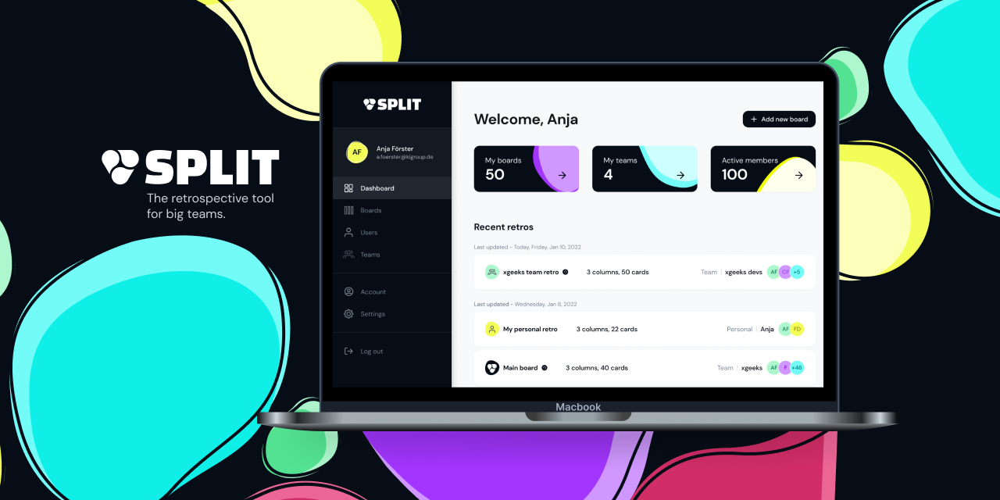

<h4 align="center">The retrospective tool fro big teams</h4>

 

[![All Contributors][all-contributors-badge]](#contributors)

[![Code of Conduct][coc-badge]][coc]

## Table of Contents

- [❗ Code of Conduct](#-code-of-conduct)
- [🙌🏻 How to Contribute](#--how-to-contribute)
- [🏃 How to Run](https://github.com/xgeekshq/split/wiki/How-to-run)
- [📃 Requirements](https://github.com/xgeekshq/split/wiki/Requirements)
- [:computer: Usage](#usage)
- [📝 License](#-license)
- [Contributors ✨](#contributors-)

## ❗ Code of Conduct

We expect everyone to abide by our [**Code of Conduct**](.github/CODE_OF_CONDUCT.md). Please read it. 🤝

## 🙌🏻 How to Contribute

Check out our [**Contributing Guide**](.github/CONTRIBUTING.md) for information on contributing.

## Usage

The backend will run on `http://localhost:BACKEND_PORT` and the frontend on `http://localhost:3000`.

- `/dashboard`: dashboard
- `/boards`: boards list
- `/boards/[boardId]`: board page

## 📝 License

Licensed under the [MIT License](./LICENSE).

## Contributors ✨

Thanks goes to these wonderful people ([emoji key](https://allcontributors.org/docs/en/emoji-key)):

<!-- ALL-CONTRIBUTORS-LIST:START - Do not remove or modify this section -->
<!-- prettier-ignore-start -->
<!-- markdownlint-disable -->
<table>
  <tr>
    <td align="center"><a href="https://github.com/nunocaseiro"> <b>Nuno Caseiro</b></a> <a href="https://github.com/xgeekshq/split/commits?author=nunocaseiro" title="Code">💻</a> <a href="https://github.com/xgeekshq/split/commits?author=nunocaseiro" title="Tests">⚠️</a> <a href="#infra-nunocaseiro" title="Infrastructure (Hosting, Build-Tools, etc)">🚇</a> <a href="https://github.com/xgeekshq/split/commits?author=nunocaseiro" title="Documentation">📖</a></td>
    <td align="center"><a href="https://github.com/gfdias"> <b>Gonçalo Dias</b></a> <a href="https://github.com/xgeekshq/split/commits?author=gfdias" title="Code">💻</a> <a href="https://github.com/xgeekshq/split/pulls?q=is%3Apr+reviewed-by%3Agfdias" title="Reviewed Pull Requests">👀</a> <a href="https://github.com/xgeekshq/split/commits?author=gfdias" title="Documentation">📖</a> <a href="#projectManagement-gfdias" title="Project Management">📆</a></td>
    <td align="center"><a href="https://github.com/rpvsilva"> <b>Rui Silva</b></a> <a href="https://github.com/xgeekshq/split/commits?author=rpvsilva" title="Code">💻</a> <a href="https://github.com/xgeekshq/split/pulls?q=is%3Apr+reviewed-by%3Arpvsilva" title="Reviewed Pull Requests">👀</a></td>
    <td align="center"><a href="https://github.com/RubenMCCarreira"> <b>Rúben Carreira</b></a> <a href="https://github.com/xgeekshq/split/commits?author=RubenMCCarreira" title="Code">💻</a> <a href="https://github.com/xgeekshq/split/pulls?q=is%3Apr+reviewed-by%3ARubenMCCarreira" title="Reviewed Pull Requests">👀</a></td>
    <td align="center"><a href="https://daniel-sousa.com"> <b>Daniel Sousa</b></a> <a href="https://github.com/xgeekshq/split/commits?author=dsousa12" title="Code">💻</a> <a href="https://github.com/xgeekshq/split/commits?author=dsousa12" title="Documentation">📖</a> <a href="https://github.com/xgeekshq/split/pulls?q=is%3Apr+reviewed-by%3Adsousa12" title="Reviewed Pull Requests">👀</a></td>
    <td align="center"><a href="https://github.com/f-morgado"> <b>f-morgado</b></a> <a href="https://github.com/xgeekshq/split/commits?author=f-morgado" title="Code">💻</a> <a href="https://github.com/xgeekshq/split/commits?author=f-morgado" title="Documentation">📖</a></td>
    <td align="center"><a href="https://github.com/r-dmatos"> <b>r-dmatos</b></a> <a href="https://github.com/xgeekshq/split/commits?author=r-dmatos" title="Code">💻</a> <a href="https://github.com/xgeekshq/split/commits?author=r-dmatos" title="Documentation">📖</a></td>
  </tr>
  <tr>
    <td align="center"><a href="https://github.com/CatiaBarroco-xgeeks"> <b>CatiaBarroco-xgeeks</b></a> <a href="https://github.com/xgeekshq/split/commits?author=CatiaBarroco-xgeeks" title="Code">💻</a> <a href="https://github.com/xgeekshq/split/commits?author=CatiaBarroco-xgeeks" title="Documentation">📖</a></td>
    <td align="center"><a href="https://github.com/joaosantos99"> <b>João Santos</b></a> <a href="https://github.com/xgeekshq/split/commits?author=joaosantos99" title="Code">💻</a> <a href="https://github.com/xgeekshq/split/commits?author=joaosantos99" title="Documentation">📖</a></td>
    <td align="center"><a href="https://github.com/dvpfran"> <b>Luís Francisco</b></a> <a href="https://github.com/xgeekshq/split/commits?author=dvpfran" title="Code">💻</a> <a href="https://github.com/xgeekshq/split/commits?author=dvpfran" title="Documentation">📖</a></td>
    <td align="center"><a href="https://github.com/geomarb"> <b>Geomar Bastiani</b></a> <a href="https://github.com/xgeekshq/split/commits?author=geomarb" title="Code">💻</a> <a href="https://github.com/xgeekshq/split/commits?author=geomarb" title="Documentation">📖</a></td>
  </tr>
</table>

<!-- markdownlint-restore -->
<!-- prettier-ignore-end -->

<!-- ALL-CONTRIBUTORS-LIST:END -->

This project follows the [all-contributors](https://github.com/all-contributors/all-contributors) specification. Contributions of any kind welcome!

[all-contributors-badge]: https://img.shields.io/github/all-contributors/xgeekshq/divide-and-conquer?color=orange&style=flat-square
[coc]: .github/CODE_OF_CONDUCT.md
[coc-badge]: https://img.shields.io/badge/code%20of-conduct-ff69b4.svg?style=flat-square

---

  

<h4 align="center">xgeeks Open Source</h4>
